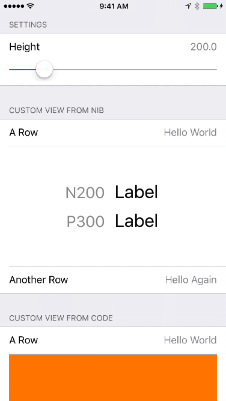

By [Mark Alldritt](http://markalldritt.com).

## Introduction

ViewRow is a [Eureka](https://github.com/xmartlabs/Eureka) row that allows you to display any UIView (or UIView subclass) within a Eureka row.  Views can be created in code or loaded from nib files.  ViewRow handles all interactions with Eureka allowing you to focus on developing your UIView subclass or Nib file.



## ViewRow Usage

### Create view in code

```swift
import Eureka

class ViewController: FormViewController {

    override func viewDidLoad() {
        super.viewDidLoad()

        form
            +++ Section("ViewRow Demo")
                <<< ViewRow<MyView>("view") { (row) in
                    row.title = "My View Title" // optional
                }
                .cellSetup { (cell, row) in
                    //  Construct the view for the cell
                    cell.view = UIView(frame: CGRect(x: 0, y: 0, width: 100, height: 200))
                    cell.view?.backgroundColor = UIColor.orange
                }
    }
}
```

### Load view from a nib file

```swift
import Eureka

class ViewController: FormViewController {

    override func viewDidLoad() {
        super.viewDidLoad()

        form
            +++ Section("ViewRow Demo")
                <<< ViewRow<MyView>("view") { (row) in
                    row.title = "My View Title" // optional
                }
                .cellSetup { (cell, row) in
                    //  Construct the view
                    let bundle = Bundle.main
                    let nib = UINib(nibName: "MyView", bundle: bundle)
                    
                    cell.view = nib.instantiate(withOwner: self, options: nil)[0] as? MyView
                    cell.view?.backgroundColor = cell.backgroundColor
                }
    }
}
```

The ViewRow example application (used to generate the movie shown above) illustrates the various ways in which ViewRow can be used to host various types of UIView within a Eureka form.


## Requirements

* iOS 10.0+
* Xcode 8.3+
* Eureka 3.0.*

## Getting involved

* If you **want to contribute** please feel free to **submit pull requests**.
* If you **have a feature request** please **open an issue**.
* If you **found a bug** or **need help** please **check older issues, [FAQ](#faq) before submitting an issue.**.

Before contribute check the [CONTRIBUTING](https://github.com/EurekaCommunity/ImageRow/blob/master/CONTRIBUTING.md) file for more info.

If you use **ViewRow** in your app I would love to hear about it! Drop me a line at [alldritt@latenightsw.com](email:alldritt@latenightsw.com).


## Installation

1. Add `pod 'ViewRow', :git => 'https://github.com/EurekaCommunity/ViewRow'` to your Podfile
2. Run `$ pod install`


## ViewRow Customization

The following properties control the placement of the title and view within the row: 

  `viewRightMargin`  
  `viewLeftMargin`  
  `viewTopMargin`  
  `viewBottomMargin`
    
  `titleLeftMargin`  
  `titleRightMargin`  
  `titleTopMargin`  
  `titleBottomMargin`  

If the value of the row's `title` property is nil or blank, the title portion of the row is hidden.

## To-Dos

Currently, ViewRow supports auto-layout within a view but does not allow auto-layout constraints to effect the height of the row.  This is an improvement I would like to add in the future.


## Author

- [Mark Alldritt](http://markalldritt.com)

## FAQ

nothing yet

## See Also

[Fluid Slider Demo](https://github.com/alldritt/EurekaFluidSlider) 

## Other Rows

See my other contributions to the Eureka Community:

- [ColorPickerRow](https://github.com/EurekaCommunity/ColorPickerRow)
